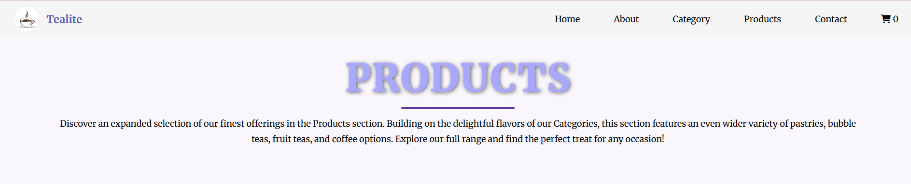
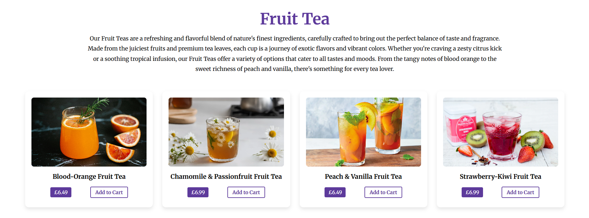
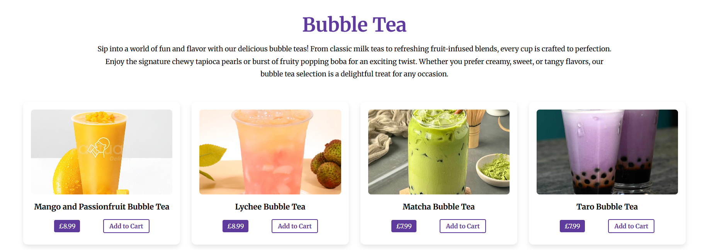
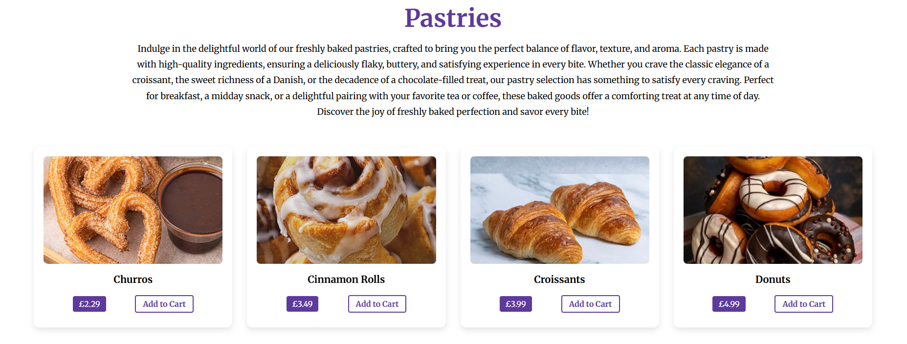
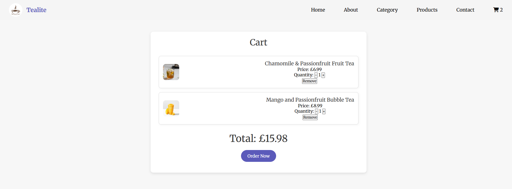
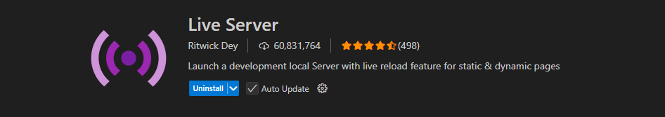

# Welcome To My Teashop

## Table of Contents

1. [Overview](#overview)
2. [Features](#features)
3. [Demo](#demo)
4. [Technologies Used](#technologies-used)
5. [Installation](#installation)
6. [Live Site](#live-site)

This project simulates a local tea business website where customers can view the menu, explore different tea varieties, and learn about the business.

This project is a visually appealing web layout using HTML, CSS, and JS. It features responsive design, interactive card elements with hover effects, and a modern button, the ability to add items to the cart, which shows the number of items on the icon, and a hamburger menu. The layout is designed to adapt to various screen sizes, making it mobile-friendly.

## Features

- **Tea Menu**: A section to display a variety of teas and beverages.
- **Contact Form**: Allows customers to easily get in touch.
- **Responsive Design**: Fully responsive layout that works on desktop and mobile devices.
- **JavaScript**: Allows for further interactivity such as pop-up messages and number count in the cart icon.

## Demo

## Technologies Used

- **HTML**: Basic structure for the page.
- **CSS**: Styling for the page, including layout, typography, and interactive effects.
- **JavaScript**: Adds interactivity to the page, such as form validation, dynamic content updates, and other interactive features.

## Installation

To get started, follow these steps:

1. Clone this repository in gitbash:
   git clone https://github.com/SabKaz78614/Local-Tea-Business.git
2. To check, navigate to the project folder in file explorer: Local-Tea-Business. Click on index.html to open in browser.

Alternatively:

1. open up VS code and open Local-Tea-Business folder to view code.
2. download the live site extention.

3. click go live at bottom left of VS code.

## Live Site
Visit the live demo:  https://sabkaz78614.github.io/Local-Tea-Business/

If there are any issues visit the site at [Tealite](https://tealite.netlify.app)